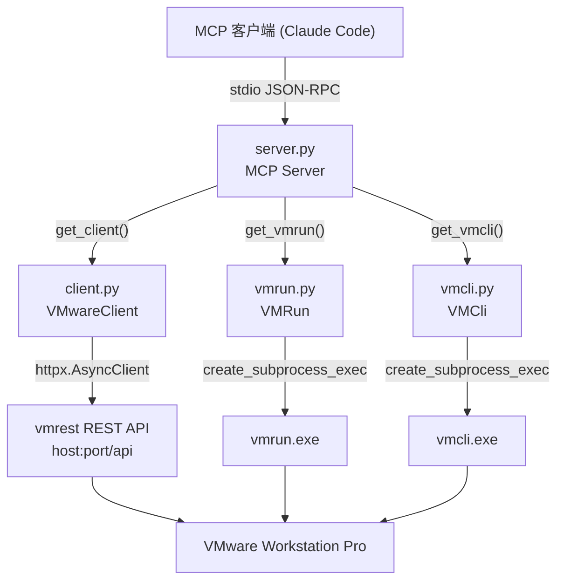

# vmware-mcp — 项目架构报告

**分析时间**：2026-09-25_153605
**分析范围**：`C:\Users\Administrator\Desktop\zcode\mcp开发\VMware\vmware-mcp-gy`
**分析模式**：完整分析（小型项目，5 个 Python 源文件，共 1155 行）

---

## 1. 技术栈全景

### 编程语言

| 语言 | 文件数 | 代码行数 | 占比 | 主要用途 |
|------|--------|---------|------|---------|
| Python | 5 | 1155 | 100% | MCP 服务器、REST 客户端、CLI 封装 |

代码行数分布（`wc -l` 实测）：

| 文件 | 行数 | 职责 |
|------|------|------|
| `src/vmware_mcp/server.py` | 528 | MCP 服务器：工具注册与分发 |
| `src/vmware_mcp/vmcli.py` | 308 | vmcli.exe 命令行封装 |
| `src/vmware_mcp/vmrun.py` | 222 | vmrun.exe 命令行封装 |
| `src/vmware_mcp/client.py` | 94 | VMware REST API HTTP 客户端 |
| `src/vmware_mcp/__init__.py` | 3 | 包标识与版本号 |

### 框架与运行时

| 技术 | 版本约束 | 用途 | 配置文件来源 |
|------|---------|------|-------------|
| Python | >= 3.10 | 运行时（使用了 `dict[str, str]`、`str \| None` 等 3.10+ 语法，见 `src/vmware_mcp/server.py:14`、`src/vmware_mcp/vmrun.py:10`） | `pyproject.toml:6` |
| mcp | >= 1.0.0 | Model Context Protocol 官方 SDK（Server、stdio_server、Tool、TextContent） | `pyproject.toml:8` |
| httpx | >= 0.27.0 | 异步 HTTP 客户端（REST API 调用） | `pyproject.toml:9` |
| hatchling | — | 构建后端 | `pyproject.toml:16-17` |

### 构建与工具链

- 构建工具：hatchling（`pyproject.toml:15-17`）
- 包管理器：pip（README 推荐安装方式为 `pip install -e .`，`README.md:26`）
- 入口脚本：`vmware-mcp = "vmware_mcp.server:main"`（`pyproject.toml:12-13`）
- 代码检查：未配置（无 ruff/flake8/mypy 配置）
- 格式化：未配置
- 测试框架：未配置（全仓库无任何测试文件）

### 外部服务与基础设施

| 服务 | 集成方式 | 代码位置 |
|------|---------|---------|
| VMware Workstation REST API（vmrest） | httpx 异步 HTTP，基础 URL `http://{host}:{port}/api` | `src/vmware_mcp/client.py:11` |
| vmrun.exe（VMware 命令行工具） | `asyncio.create_subprocess_exec` 子进程调用 | `src/vmware_mcp/vmrun.py:25-29` |
| vmcli.exe（VMware 命令行工具） | `asyncio.create_subprocess_exec` 子进程调用 | `src/vmware_mcp/vmcli.py:25-29` |
| Claude Code / MCP 客户端 | stdio JSON-RPC（`stdio_server`） | `src/vmware_mcp/server.py:521` |

无数据库、无缓存服务、无消息队列——唯一的"持久化状态"是模块级内存缓存 `_vm_path_cache`（`src/vmware_mcp/server.py:14`）。

---

## 2. 目录结构与功能角色

```
vmware-mcp-gy/
├── src/
│   └── vmware_mcp/                # [核心源码] 唯一的 Python 包
│       ├── __init__.py            # [基础设施] 包标识，__version__ = "0.1.0"
│       ├── server.py              # [入口层+表现层] MCP 服务器：注册 130 个工具并分发调用
│       ├── client.py              # [外部接口层] VMware REST API（vmrest）HTTP 封装
│       ├── vmrun.py               # [基础设施] vmrun.exe 子进程封装（46 个命令方法）
│       └── vmcli.py               # [基础设施] vmcli.exe 子进程封装（67 个命令方法）
├── pyproject.toml                 # [配置] 项目元数据、依赖、入口脚本
├── README.md                      # [文档] 中文化说明与工具清单
├── .gitignore                     # [配置] Python 标准忽略规则
└── note/                          # [文档] 本分析报告输出目录
```

### 目录角色标注说明

- **[入口层]** — `server.py` 的 `main()`（`server.py:517-524`）与 `pyproject.toml:13` 的 console script 指向
- **[表现层]** — `server.py` 的 `list_tools()` / `call_tool()`（`server.py:56-224`、`server.py:227-514`），面向 MCP 客户端暴露工具
- **[外部接口层]** — `client.py` 的 `VMwareClient`，对外 REST 通信
- **[基础设施]** — `vmrun.py`、`vmcli.py` 的进程封装与 `__init__.py`

项目为单包扁平结构：没有 services/domain/tests 目录，全部逻辑集中在 4 个模块中，呈"薄网关 + 三条平行通道"形态。

---

## 3. 模块依赖关系

### 核心依赖图



### 模块间依赖分析

| 源模块 | 目标模块 | 依赖类型 | 关键代码 |
|--------|---------|---------|---------|
| `server.py` | `client.py` | 导入类 `VMwareClient` | `server.py:9` |
| `server.py` | `vmcli.py` | 导入类 `VMCli` | `server.py:10` |
| `server.py` | `vmrun.py` | 导入类 `VMRun` | `server.py:11` |
| `server.py` | `mcp.server` / `mcp.types` | 框架依赖 | `server.py:5-7` |
| `client.py` | `httpx` | 库依赖 | `client.py:3` |
| `vmrun.py` / `vmcli.py` | `asyncio` / `os` | 标准库 | `vmrun.py:3-4`、`vmcli.py:3-4` |

依赖方向严格单向：`server.py → 三个适配器 → 外部 VMware 组件`。三个适配器模块之间零互相依赖，`client.py`、`vmrun.py`、`vmcli.py` 不导入 `server.py`，也不互相导入（经全文件通读确认）。

### 外部依赖（pip 包）

仅 2 个第三方依赖（`pyproject.toml:7-10`）：
- `mcp>=1.0.0` — MCP SDK
- `httpx>=0.27.0` — HTTP 客户端

---

## 4. 架构模式识别

### 模式 1：适配器/网关模式（Adapter + Gateway）

- **判断依据**：`server.py` 将三种异构接口（HTTP REST、vmrun CLI、vmcli CLI）统一适配为 MCP Tool 协议。三个适配器类各自封装一种通道：`VMwareClient`（`client.py:7-94`）、`VMRun`（`vmrun.py:7-222`）、`VMCli`（`vmcli.py:9-308`）。
- **表现位置**：`server.py:227-514` 的 `call_tool()` 是唯一网关，130 个工具全部经由它分发。
- **特征**：MCP 客户端无需感知底层是 REST 还是子进程。

### 模式 2：注册表 + 巨型分发（Registry + Mega Dispatcher）

- **判断依据**：`list_tools()` 返回 130 个 `T(...)` 构造的工具定义（`server.py:56-224`），`call_tool()` 用约 272 行的 if/elif 链按工具名分发（`server.py:239-510`）。
- **表现位置**：`server.py:48-53` 的 `T()` 工厂函数统一构造 `Tool(name, description, inputSchema)`。
- **特征**：工具"声明"（schema）与工具"实现"（分发分支）分离在两个函数中，靠字符串名称人工对齐——没有映射表保证一致性（这是本架构最主要的结构性风险，详见 04 报告）。

### 模式 3：每请求工厂实例化（Factory per Request）

- **判断依据**：`call_tool()` 每次被调用都重新构造三个适配器实例：`client = get_client()`、`vmcli = get_vmcli()`、`vmrun = get_vmrun()`（`server.py:229-231`）；`get_client()` 每次从环境变量重建 `VMwareClient`（`server.py:17-23`）。
- **表现位置**：`server.py:17-31`。
- **特征**：无单例/连接池/依赖注入容器，实例无状态、可随时重建，代价是 REST 通道无法复用 HTTP 连接（`client.py:15` 每个请求新建 `httpx.AsyncClient`）。

### 模式 4：同构薄封装（Homogeneous Thin Wrapper）

- **判断依据**：`vmrun.py` 的 46 个命令方法与 `vmcli.py` 的 67 个命令方法全部遵循同一模板——组装参数后委托给各自的 `_run()`。例如 `start()`（`vmrun.py:41-42`）仅一行 `return await self._run("start", vmx_path, "gui" if gui else "nogui")`。
- **表现位置**：`vmrun.py:40-222`、`vmcli.py:38-308`。
- **特征**：极高重复度、极低复杂度，是典型的"AI 可批量生成"代码形态。

---

## 5. 函数级调用链（全覆盖）

### 5.1 server.py（10 个函数/入口）

| 函数 | 签名 | 位置 | 行数 | 调用去向 |
|------|------|------|------|---------|
| `get_client` | `() -> VMwareClient` | `server.py:17-23` | 7 | `VMwareClient.__init__`（`client.py:10`） |
| `get_vmcli` | `() -> VMCli` | `server.py:26-27` | 2 | `VMCli.__init__`（`vmcli.py:12`） |
| `get_vmrun` | `() -> VMRun` | `server.py:30-31` | 2 | `VMRun.__init__`（`vmrun.py:10`） |
| `get_vmx_path` | `async (vm_id: str) -> str` | `server.py:34-45` | 12 | `get_client` → `client.list_vms` |
| `T` | `(name: str, desc: str, props: dict, required: list \| None = None) -> Tool` | `server.py:48-53` | 6 | `mcp.types.Tool` 构造器 |
| `list_tools` | `async () -> list[Tool]`（装饰器 `@server.list_tools()`） | `server.py:56-224` | 169 | `T` ×130 |
| `call_tool` | `async (name: str, arguments: dict) -> list[TextContent]`（装饰器 `@server.call_tool()`） | `server.py:227-514` | 288 | 三个适配器全部公共方法 |
| `vmx`（`call_tool` 内嵌套闭包） | `async (vm_id: str) -> str` | `server.py:236-237` | 2 | `get_vmx_path` |
| `main` | `() -> None` | `server.py:517-524` | 8 | `asyncio.run(run())` |
| `run`（main 内嵌套闭包） | `async () -> None` | `server.py:520-522` | 3 | `stdio_server` → `server.run` |

#### 调用链 1：REST 工具（以 `vm_list` 为例）

```
call_tool("vm_list", {})                    server.py:240-243
  ├── get_client()                          server.py:17-23
  │     └── VMwareClient(host, port, ...)   client.py:10-12
  │           [读取 os.getenv: VMWARE_HOST/VMWARE_PORT/VMWARE_USERNAME/VMWARE_PASSWORD]
  ├── client.list_vms()                     client.py:23-24
  │     └── _request("GET", "/vms")         client.py:14-20
  │           ├── httpx.AsyncClient(auth=..., verify=False)   client.py:15
  │           ├── client.request(...)       client.py:16
  │           ├── resp.raise_for_status()   client.py:17
  │           └── return resp.json()        client.py:19
  └── for vm in result: _vm_path_cache[vm["id"]] = vm["path"]  server.py:242-243
        [副作用: 填充全局 vmx 路径缓存]
```

#### 调用链 2：vmrun 工具（以 `vmrun_start` 为例）

```
call_tool("vmrun_start", {vm_id, gui})      server.py:295-296
  ├── vmx(a["vm_id"])                       server.py:236-237
  │     └── get_vmx_path(vm_id)             server.py:34-45
  │           ├── vm_id.endswith(".vmx") or "/" in vm_id or "\\" in vm_id  server.py:37
  │           │     [True → 直接返回 vm_id，短路]
  │           ├── get_client() → client.list_vms()  server.py:41-42 → client.py:23
  │           └── return _vm_path_cache.get(vm_id, "")  server.py:45
  └── vmrun.start(vmx_path, gui)            vmrun.py:41-42
        └── _run("start", vmx_path, "gui"/"nogui")   vmrun.py:16-38
              ├── cmd = [vmrun_path, "-T", "ws", ...]   vmrun.py:17-23
              │     [guest_user → -gu；guest_pass → -gp]
              ├── asyncio.create_subprocess_exec(*cmd)   vmrun.py:25-29
              ├── proc.communicate()            vmrun.py:30
              ├── if returncode != 0: raise RuntimeError("vmrun failed: ...")  vmrun.py:32-36
              └── return stdout.decode("utf-8").strip()   vmrun.py:38
```

#### 调用链 3：vmcli 工具（以 `chipset_set_cpu` 为例）

```
call_tool("chipset_set_cpu", {vm_id, count})  server.py:419-420
  ├── vmx(a["vm_id"]) → get_vmx_path()      server.py:236-237 → 34-45
  └── vmcli.chipset_set_cpu(vmx_path, count)  vmcli.py:154-155
        └── _run(vmx_path, "Chipset", "SetVCpuCount", "-c", str(count))  vmcli.py:18-36
              ├── cmd = [vmcli_path, vmx_path, "Chipset", "SetVCpuCount", "-c", "2"]  vmcli.py:19-23
              ├── asyncio.create_subprocess_exec(*cmd)   vmcli.py:25-29
              ├── if returncode != 0: raise RuntimeError("vmcli failed: ...")  vmcli.py:32-34
              └── return stdout.decode("utf-8").strip()   vmcli.py:36
```

#### 调用链 4：启动链

```
main()                                      server.py:517
  └── asyncio.run(run())                    server.py:524
        └── stdio_server() → (read_stream, write_stream)   server.py:521
              └── server.run(read_stream, write_stream,
                             server.create_initialization_options())   server.py:522
                    [mcp SDK 接管: JSON-RPC 循环 → list_tools/call_tool 回调]
```

### 5.2 client.py（25 个方法）

| 方法 | 签名 | 位置 | 对应 REST 端点 |
|------|------|------|---------------|
| `__init__` | `(host="localhost", port=8697, username="", password="")` | `client.py:10-12` | 构造 `base_url` 与 `auth` |
| `_request` | `async (method, path, **kwargs) -> Any` | `client.py:14-20` | 通用请求执行 |
| `list_vms` | `async () -> list[dict]` | `client.py:23-24` | GET `/vms` |
| `get_vm` | `async (vm_id) -> dict` | `client.py:26-27` | GET `/vms/{vm_id}` |
| `create_vm` | `async (vm_id, name) -> dict` | `client.py:29-30` | POST `/vms/{vm_id}` |
| `delete_vm` | `async (vm_id) -> None` | `client.py:32-33` | DELETE `/vms/{vm_id}` |
| `update_vm` | `async (vm_id, settings) -> dict` | `client.py:35-36` | PUT `/vms/{vm_id}` |
| `get_power_state` | `async (vm_id) -> dict` | `client.py:39-40` | GET `/vms/{vm_id}/power` |
| `change_power_state` | `async (vm_id, state) -> dict` | `client.py:42-43` | PUT `/vms/{vm_id}/power` |
| `list_nics` | `async (vm_id) -> list[dict]` | `client.py:46-47` | GET `/vms/{vm_id}/nic` |
| `create_nic` | `async (vm_id, nic_config) -> dict` | `client.py:49-50` | POST `/vms/{vm_id}/nic` |
| `update_nic` | `async (vm_id, index, nic_config) -> dict` | `client.py:52-53` | PUT `/vms/{vm_id}/nic/{index}`（未被 MCP 工具暴露） |
| `delete_nic` | `async (vm_id, index) -> None` | `client.py:55-56` | DELETE `/vms/{vm_id}/nic/{index}` |
| `get_vm_ip` | `async (vm_id) -> dict` | `client.py:58-59` | GET `/vms/{vm_id}/ip` |
| `list_shared_folders` | `async (vm_id) -> list[dict]` | `client.py:62-63` | GET `/vms/{vm_id}/sharedfolders` |
| `create_shared_folder` | `async (vm_id, folder_config) -> dict` | `client.py:65-66` | POST `/vms/{vm_id}/sharedfolders` |
| `update_shared_folder` | `async (vm_id, folder_id, folder_config) -> dict` | `client.py:68-69` | PUT `/vms/{vm_id}/sharedfolders/{folder_id}`（未被 MCP 工具暴露） |
| `delete_shared_folder` | `async (vm_id, folder_id) -> None` | `client.py:71-72` | DELETE `/vms/{vm_id}/sharedfolders/{folder_id}` |
| `list_networks` | `async () -> list[dict]` | `client.py:75-76` | GET `/vmnet` |
| `create_network` | `async (network_config) -> dict` | `client.py:78-79` | POST `/vmnets` |
| `get_mac_to_ips` | `async (vmnet) -> list[dict]` | `client.py:81-82` | GET `/vmnet/{vmnet}/mactoip`（未被 MCP 工具暴露） |
| `update_mac_to_ip` | `async (vmnet, mac, ip) -> dict` | `client.py:84-85` | PUT `/vmnet/{vmnet}/mactoip/{mac}`（未被 MCP 工具暴露） |
| `get_portforwards` | `async (vmnet) -> list[dict]` | `client.py:87-88` | GET `/vmnet/{vmnet}/portforward` |
| `update_portforward` | `async (vmnet, protocol, port, config) -> dict` | `client.py:90-91` | PUT `/vmnet/{vmnet}/portforward/{protocol}/{port}` |
| `delete_portforward` | `async (vmnet, protocol, port) -> None` | `client.py:93-94` | DELETE `/vmnet/{vmnet}/portforward/{protocol}/{port}` |

**跨层调用标注**：`server.py`（表现层）→ `client.py`（外部接口层）共使用上述方法中的 19 个；`update_nic`、`update_shared_folder`、`get_mac_to_ips`、`update_mac_to_ip` 4 个方法已实现但未接入任何 MCP 工具（死代码，经 `server.py` 全文检索确认无引用）。

### 5.3 vmrun.py（48 个方法）

`_run`（`vmrun.py:16-38`）是唯一的执行核心；46 个命令方法全部为同构薄封装。完整清单（签名均为 `async (vmx_path: str, ...) -> str`，guest 类方法额外带 `user: str = "", password: str = ""`）：

| 分组 | 方法（位置） | 映射的 vmrun 命令 |
|------|-------------|------------------|
| Power | `start`（41-42）、`stop`（44-45）、`reset`（47-48）、`suspend`（50-51）、`pause`（53-54）、`unpause`（56-57） | `start`/`stop`/`reset`/`suspend`/`pause`/`unpause` |
| General | `list_running`（60-61）、`upgrade_vm`（63-64）、`delete_vm`（66-67）、`clone`（69-75） | `list`/`upgradevm`/`deleteVM`/`clone` |
| Snapshot | `list_snapshots`（78-82）、`snapshot`（84-85）、`delete_snapshot`（87-91）、`revert_to_snapshot`（93-94） | `listSnapshots`/`snapshot`/`deleteSnapshot`/`revertToSnapshot` |
| Guest File | `file_exists`（97-98）、`directory_exists`（100-101）、`rename_file`（103-104）、`create_temp_file`（106-107）、`list_directory`（109-110）、`create_directory`（112-113）、`delete_directory`（115-116）、`delete_file`（118-119）、`copy_to_guest`（121-122）、`copy_from_guest`（124-125） | `fileExistsInGuest` 等 10 个 `*InGuest` 命令 |
| Guest Process | `run_program`（128-139）、`run_script`（141-150）、`list_processes`（152-153）、`kill_process`（155-156） | `runProgramInGuest` 等 4 个命令 |
| Shared Folders | `enable_shared_folders`（159-160）、`disable_shared_folders`（162-163）、`add_shared_folder`（165-166）、`remove_shared_folder`（168-169）、`set_shared_folder_state`（171-172） | 5 个命令 |
| Device | `connect_device`（175-176）、`disconnect_device`（178-179） | `connectNamedDevice`/`disconnectNamedDevice` |
| Variables | `read_variable`（182-183）、`write_variable`（185-186） | `readVariable`/`writeVariable` |
| Screen/Input | `capture_screen`（189-190）、`type_keystrokes`（192-193） | `captureScreen`/`typeKeystrokesInGuest` |
| Tools | `install_tools`（196-197）、`check_tools_state`（199-200） | `installTools`/`checkToolsState` |
| Network | `get_guest_ip`（203-207）、`list_host_networks`（209-210）、`list_port_forwardings`（212-213）、`set_port_forwarding`（215-219）、`delete_port_forwarding`（221-222） | `getGuestIPAddress` 等 5 个命令 |

**异步/并发点标注**：`_run` 中 `create_subprocess_exec` + `communicate()`（`vmrun.py:25-30`）是全类唯一的异步点；无并发控制（同一 VM 的并发命令最终行为由 VMware 底层决定——推断，未验证）。

### 5.4 vmcli.py（69 个方法）

`_run`（`vmcli.py:18-36`）与 67 个命令方法同构。与 `vmrun.py` 的差异：`_run` 首参为 `vmx_path: str | None`（`None` 时不传 vmx，如 `template_deploy`，`vmcli.py:177-178`），且命令采用 `模块 + 子命令 + 选项` 三段式（如 `Snapshot, Take, -n, name`）。

| 分组 | 方法数 | 位置 | 映射的 vmcli 模块 |
|------|--------|------|------------------|
| Snapshot | 5 | `vmcli.py:39-55` | `Snapshot`（query/Take/Revert/Delete/Clone） |
| Guest | 10 | `vmcli.py:58-138` | `Guest`（run/ps/kill/ls/mkdir/rm/rmdir/copyTo/copyFrom/env） |
| MKS | 3 | `vmcli.py:141-148` | `MKS`（captureScreenshot/sendKeySequence/query） |
| Chipset | 4 | `vmcli.py:151-161` | `Chipset`（query/SetVCpuCount/SetMemSize/SetCoresPerSocket） |
| Tools | 3 | `vmcli.py:164-171` | `Tools`（Query/Install/Upgrade） |
| VMTemplate | 2 | `vmcli.py:174-178` | `VMTemplate`（Create/Deploy） |
| Disk | 3 | `vmcli.py:181-188` | `Disk`（query/Create/Extend） |
| VM | 1 | `vmcli.py:191-192` | `VM`（Create）——未被 MCP 工具暴露 |
| ConfigParams | 2 | `vmcli.py:195-199` | `ConfigParams`（query/SetEntry） |
| Power | 7 | `vmcli.py:202-221` | `Power`（query/Start/Stop/Pause/Unpause/Reset/Suspend） |
| Ethernet | 7 | `vmcli.py:224-243` | `Ethernet`（query/SetConnectionType/SetPresent/SetStartConnected/SetVirtualDevice/SetNetworkName/Purge） |
| HGFS | 7 | `vmcli.py:246-265` | `HGFS`（query/SetEnabled/SetHostPath/SetGuestName/SetPresent/SetReadAccess/SetWriteAccess），其中 `hgfs_set_present`（258-259）未被 MCP 工具暴露 |
| Serial | 3 | `vmcli.py:268-275` | `Serial`（Query/SetPresent/Purge） |
| Sata | 3 | `vmcli.py:278-285` | `Sata`（query/SetPresent/Purge） |
| Nvme | 3 | `vmcli.py:288-295` | `Nvme`（query/SetPresent/Purge） |
| VProbes | 4 | `vmcli.py:298-308` | `VProbes`（Query/SetEnabled/Load/Reset） |

**死代码**：`vmcli.vm_create`（`vmcli.py:191-192`）与 `vmcli.hgfs_set_present`（`vmcli.py:258-259`）、`client.update_nic`、`client.update_shared_folder`、`client.get_mac_to_ips`、`client.update_mac_to_ip` 共 6 个方法已实现但无 MCP 工具接入。

### 5.5 跨层调用汇总

| 层 | 暴露面 | 被上层调用 |
|----|--------|-----------|
| `server.py` 表现层 | 130 个 MCP 工具 | MCP 客户端 |
| `client.py` | 23 个 API 方法 | 19 个被 `server.py:240-284` 调用 |
| `vmrun.py` | 46 个命令方法 | 46 个被 `server.py:287-378` 调用 |
| `vmcli.py` | 67 个命令方法 | 65 个被 `server.py:381-510` 调用 |

---

## 6. 关键设计模式实例

| 模式 | 位置 | 代码示例 |
|------|------|---------|
| 工厂函数（Tool 构造） | `src/vmware_mcp/server.py:48-53` | `T(name, desc, props, required)` 统一构造 `Tool` + JSON Schema |
| 适配器 | `src/vmware_mcp/client.py:7`、`vmrun.py:7`、`vmcli.py:9` | 三个类分别适配 REST/vmrun/vmcli 三种通道 |
| 门面（Facade） | `src/vmware_mcp/server.py:227-514` | `call_tool()` 将 130 个工具收口为单一入口 |
| 惰性缓存（Memoization） | `src/vmware_mcp/server.py:14,40-45` | `_vm_path_cache` 字典缓存 VM ID → vmx 路径映射 |
| 环境变量配置注入 | `src/vmware_mcp/server.py:19-22`、`vmrun.py:11-14`、`vmcli.py:13-16` | `VMWARE_*`、`VMRUN_PATH`、`VMCLI_PATH` |

未发现的模式：单例（无全局实例，仅全局字典）、观察者、依赖注入容器、中间件链、仓库模式。

---

## 7. 架构健康度评估

| 维度 | 评分（1-5） | 说明 |
|------|------------|------|
| 模块化程度 | 4 | 三通道适配器职责清晰、零横向依赖（`client.py`/`vmrun.py`/`vmcli.py` 互不导入） |
| 依赖管理 | 5 | 仅 2 个第三方依赖（`pyproject.toml:7-10`），标准库为主 |
| 可测试性 | 2 | 无任何测试；`call_tool` 为 288 行单函数，分支不可独立测试；适配器构造函数支持路径注入（`vmrun.py:10`、`vmcli.py:12`）是仅有的可测性设计 |
| 一致性 | 2 | 声明（`list_tools`）与实现（`call_tool`）靠字符串对齐，无映射表；README 汇总（`README.md:7-13`）与代码不符（声明 117 个，实际 130 个） |
| 文档一致性 | 2 | README 正文工具表与代码一致（130 行条目），但头部汇总表数字错误 |
| 技术债务 | 3 | 6 个死方法未暴露（见 5.4/5.2）；`verify=False` 关闭 TLS 校验（`client.py:15`）；URL 路径未编码（`client.py:27` 等）；未知工具名静默返回 OK（`server.py:512-514`） |

### 架构风险清单（按严重度排序）

1. **声明/实现漂移**：`list_tools()` 与 `call_tool()` 之间的对齐完全靠人工维护字符串名。任何一侧改动（改名、漏分支）都会在运行时表现为"工具存在但调用落空"——且 `server.py:512-514` 会把落空静默包装为 `OK`，掩盖错误。
2. **静默失败路径**：`get_vmx_path` 对查不到的 VM 返回空字符串 `""`（`server.py:45`），空 vmx 路径继续传给 vmrun/vmcli，最终由 CLI 报错，错误语义丢失。
3. **安全面**：guest 密码经命令行参数 `-gp` 传递（`vmrun.py:20-21`），宿主机进程列表可见；REST 关闭 TLS 证书校验（`client.py:15`）。
4. **无测试/无 CI**：130 个工具全部无自动化验证，回归依赖人工。
