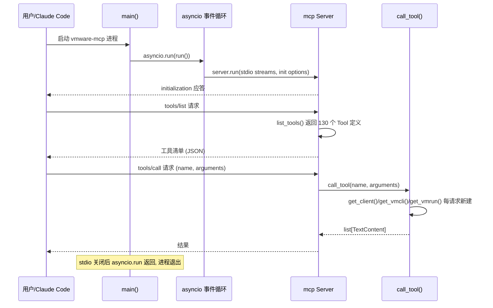
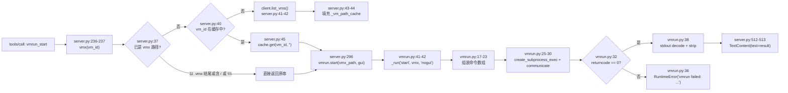
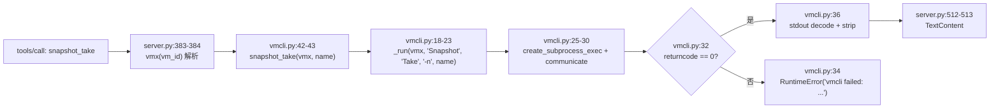
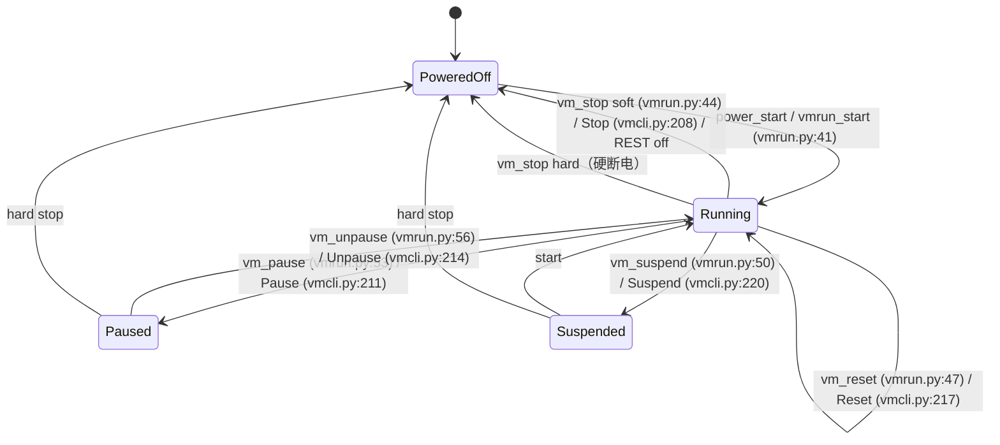

# vmware-mcp — 项目运行原理报告

**分析时间**：2026-09-25_153605
**分析范围**：`C:\Users\Administrator\Desktop\zcode\mcp开发\VMware\vmware-mcp-gy`

---

## 1. 启动初始化序列

### 入口文件

**路径**：`src/vmware_mcp/server.py` → `main()`（`server.py:517-524`）
**角色**：stdio 传输的 MCP 服务器进程入口（`pyproject.toml:13` 将 console script `vmware-mcp` 指向此处）

### 初始化步骤

| 步骤 | 操作 | 代码位置 | 说明 |
|------|------|---------|------|
| 1 | 模块导入期：创建 `Server("vmware-mcp")` 实例 | `server.py:13` | MCP SDK Server 对象，进程单例 |
| 2 | 模块导入期：创建 `_vm_path_cache = {}` 全局缓存 | `server.py:14` | VM ID → vmx 路径字典，随进程生命周期存活 |
| 3 | 模块导入期：注册 `@server.list_tools()` 回调 | `server.py:56-57` | 装饰器注册，130 个工具定义在此静态返回 |
| 4 | 模块导入期：注册 `@server.call_tool()` 回调 | `server.py:227-228` | 装饰器注册，唯一分发入口 |
| 5 | `main()` 内定义嵌套 `async def run()` | `server.py:520-522` | 闭包持有 `stdio_server` 上下文 |
| 6 | `asyncio.run(run())` 启动事件循环 | `server.py:524` | 阻塞直至 stdio 流关闭 |
| 7 | `stdio_server()` 建立 stdin/stdout JSON-RPC 流 | `server.py:521` | 无端口监听，纯标准流通信 |
| 8 | `server.run(read_stream, write_stream, create_initialization_options())` | `server.py:522` | 交给 mcp SDK 主循环，之后由 SDK 回调第 3/4 步注册的函数 |

**关键特征**：项目没有任何显式"配置加载"步骤——`VMWARE_HOST`、`VMWARE_PORT`、`VMWARE_USERNAME`、`VMWARE_PASSWORD`（`server.py:19-22`）、`VMRUN_PATH`（`vmrun.py:11-14`）、`VMCLI_PATH`（`vmcli.py:13-16`）全部在**每次工具调用时**即时读取，而非启动时读取。修改环境变量后无需重启进程即可对下一次调用生效（但连接信息每次重建实例，本就无长连接）。

### 启动时序图



### 优雅关闭机制

- **信号处理**：未实现（无 `signal` / `SIGTERM` 处理代码，全文件检索确认）。
- **关闭顺序**：stdio 流关闭 → `stdio_server` 上下文退出（`server.py:521`）→ `server.run` 返回 → `asyncio.run` 返回 → 进程自然退出。正在执行的子进程调用（`vmrun.py:30`、`vmcli.py:30` 的 `communicate()`）若无外力终止会等待完成；`_vm_path_cache` 为纯内存状态，随进程消失。

---

## 2. 核心数据流追踪

### 数据流 1：REST 通道 — `vm_get`（获取 VM 设置）

**触发方式**：MCP `tools/call`，`name="vm_get"`，`arguments={"vm_id": "vm-564d-..."}`


**变量级数据变换**：

| 步骤 | 变量名 | 类型 | 值/状态变化 | 代码位置 |
|------|--------|------|------------|---------|
| 函数入口 | `arguments` | `dict` | `{"vm_id": "vm-564d-abcd"}` | `server.py:228` |
| 提取参数 | `a["vm_id"]` | `str` | `"vm-564d-abcd"` | `server.py:245` |
| URL 拼接 | `path` | `str` | `"/vms/vm-564d-abcd"`（f-string 直接拼接，未 URL 编码） | `client.py:27` |
| HTTP 响应 | `resp` | `httpx.Response` | 状态码 200，JSON body | `client.py:16` |
| 反序列化 | `result` | `dict` | `{"id": "...", "path": "...", "cpu": {...}}` | `client.py:19` |
| 回包序列化 | `text` | `str` | `json.dumps(result, indent=2)` | `server.py:514` |

**错误分支**：若 REST 返回 4xx/5xx，`raise_for_status()`（`client.py:17`）抛出 `httpx.HTTPStatusError`，向上穿透 `call_tool`（无 try/except，`server.py:227-514` 通篇无异常捕获），由 mcp SDK 捕获并转换为 MCP 错误响应。

### 数据流 2：vmrun 通道 — `vmrun_start`（含 vmx 路径解析）

**触发方式**：MCP `tools/call`，`name="vmrun_start"`，`arguments={"vm_id": "vm-564d-abcd", "gui": false}`



**变量级数据变换**：

| 步骤 | 变量名 | 类型 | 值/状态变化 | 代码位置 |
|------|--------|------|------------|---------|
| 函数入口 | `vm_id` | `str` | `"vm-564d-abcd"` | `server.py:296` |
| 路径判定 | `vm_id`（经 `get_vmx_path`） | `str` | 缓存未命中 → 触发 `list_vms()` 全量拉取 | `server.py:37-44` |
| 路径产出 | `vmx_path` | `str` | `"C:\Users\admin\Documents\Virtual Machines\Win10\Win10.vmx"` | `server.py:45` |
| 布尔映射 | `gui=False` | `str` | `"nogui"`（`"gui" if gui else "nogui"`） | `vmrun.py:42` |
| 命令数组 | `cmd` | `list[str]` | `["C:\...\vmrun.exe", "-T", "ws", "start", "C:\...\Win10.vmx", "nogui"]` | `vmrun.py:17-23` |
| 子进程 | `proc.returncode` | `int` | 0（成功） | `vmrun.py:30-32` |
| 输出解码 | 返回值 | `str` | `b"..."` → utf-8 decode → `.strip()` | `vmrun.py:38` |
| 回包 | `TextContent.text` | `str` | `result` 非空则原样，空串则 `"OK"` | `server.py:512-513` |

**数据格式变化点**：`dict（MCP 参数）` → `str（vmx 路径）` → `list[str]（argv）` → `bytes（stdout）` → `str（结果文本）` → `TextContent（MCP 响应）`。

**边界条件与副作用**：
- `get_vmx_path` 每次缓存未命中都会**全量拉取** VM 列表并覆盖式填充缓存（`server.py:41-44`）——若两次调用之间有新 VM 创建，第二次未命中时会顺带刷新；但**已缓存的陈旧条目不会被清除**（无失效机制，VM 删除后缓存残留）。
- 缓存查找失败返回 `""`（`server.py:45`），不报错；空路径继续传入 vmrun，最终错误信息来自 CLI 层，丢失"VM ID 不存在"的语义。

### 数据流 3：vmcli 通道 — `snapshot_take`（创建快照）

**触发方式**：MCP `tools/call`，`name="snapshot_take"`，`arguments={"vm_id": "vm-564d-abcd", "name": "clean-state"}`



**变量级数据变换**：

| 步骤 | 变量名 | 类型 | 值/状态变化 | 代码位置 |
|------|--------|------|------------|---------|
| 参数提取 | `a["name"]` | `str` | `"clean-state"` | `server.py:384` |
| 命令三段式 | `module, command` | `str, str` | `"Snapshot", "Take"` | `vmcli.py:43` |
| 选项数组 | `args` | `list[str]` | `["-n", "clean-state"]` | `vmcli.py:43` |
| 完整 argv | `cmd` | `list[str]` | `[vmcli.exe, vmx路径, "Snapshot", "Take", "-n", "clean-state"]` | `vmcli.py:19-23` |
| 输出 | 返回值 | `str` | vmcli 文本输出 | `vmcli.py:36` |

**与 vmrun 通道的结构差异**：vmcli 的 guest 类方法采用"可选参数动态追加"模式——`user`/`password` 仅在非空时追加 `-u`/`-P`（如 `vmcli.py:62-65`），而 vmrun 统一在 `_run` 前缀处理（`vmrun.py:18-21`）。

### 数据流 4：响应统一出口（`call_tool` 尾部）

所有 130 个分支共享同一出口（`server.py:512-514`）：

```python
if isinstance(result, str):
    return [TextContent(type="text", text=result if result else "OK")]
return [TextContent(type="text", text=json.dumps(result, indent=2) if result else "OK")]
```

- REST 通道产物为 `dict/list` → JSON 美化序列化；`vm_list` 分支还顺带填充 `_vm_path_cache`（`server.py:242-243`）。
- vmrun/vmcli 通道产物为 `str` → 原样返回；空串规范化为 `"OK"`。
- **潜在缺陷**：`result is None`（工具名未匹配任何分支，或方法返回 `None` 如 REST 的 delete 类在 `server.py:249-250` 已被手工补了 `{"status": "deleted"}`，但若新增方法忘记补）→ 落入 `json.dumps(None) → "null"`；而**未知工具名**会静默返回 `"OK"`，无错误提示。

---

## 3. 状态管理分析

### 应用状态

| 状态类型 | 管理方式 | 存储位置 | 关键代码 |
|---------|---------|---------|---------|
| VM ID → vmx 路径缓存 | 模块级字典（进程内存） | `_vm_path_cache` | `server.py:14`，写点 `server.py:43-44,242-243`，读点 `server.py:45` |
| REST 连接配置 | 环境变量，每请求重读 | 进程环境 | `server.py:19-22` |
| CLI 可执行文件路径 | 构造参数 / 环境变量 / 硬编码默认值 | 实例属性 | `vmrun.py:11-14`、`vmcli.py:13-16` |
| REST 认证 | 环境变量 → httpx auth 元组 | 实例属性 `self.auth` | `client.py:12`（username 为空则 `auth=None`） |

无任何磁盘持久化、无数据库、无外部缓存服务。缓存失效策略：**无**（仅进程重启清空）。

### VM 电源状态机（从代码提取）

REST 通道的 `vm_power_set` 接受 6 个状态值（`server.py:68` 的 enum：`on/off/shutdown/suspend/pause/unpause`），vmrun 通道提供 6 个电源动词（`vmrun.py:41-57`），vmcli 通道提供 7 个（`vmcli.py:202-221`，多一个 `Reset`）。合并后的状态机：



**非法转换防护**：代码层无状态前置校验——直接对已关机 VM 调用 `pause` 会由 VMware 底层拒绝并以 `RuntimeError`（`vmrun.py:36`）冒泡，错误语义依赖 CLI 输出。

### 生命周期钩子

mcp SDK 内部钩子不在本项目代码内；项目自身只有两个装饰器注册点（`server.py:56`、`server.py:227`），无自定义中间件链。

---

## 4. 数据持久化分析

- **数据库**：无。
- **持久化面**：所有状态变更（电源、快照、磁盘、配置参数）均落在 **VMware Workstation 自身**（vmx 文件、vmsn 快照、vmdk 磁盘），由 REST API/CLI 写入；本项目代码不直接读写任何文件（`vmrun_screenshot`/`mks_screenshot` 的 `output_path` 由 vmrun/vmcli 进程写入，Python 侧仅传路径，`vmrun.py:189-190`、`vmcli.py:141-142`）。
- **配置来源**：全部经环境变量（见第 3 节），无 `.env` 加载代码（`.gitignore:9` 忽略 `.env` 文件，但代码未使用 dotenv）。

---

## 5. 错误处理体系

### 错误类型层次

```text
（无自定义异常类）
RuntimeError                        # 唯一被显式抛出的异常
├── "vmrun failed: {msg}"           # vmrun.py:36（stderr 优先，空则回退 stdout）
└── "vmcli failed: {msg}"           # vmcli.py:34（仅 stderr）

httpx.HTTPStatusError               # client.py:17 raise_for_status 抛出，未捕获
httpx.TransportError 族             # 网络层错误，未捕获
KeyError                            # call_tool 中 a["..."] 必填参数缺失时抛出（如 server.py:245），未捕获
```

### 错误传播机制

- **底层 → 上层**：异常直抛，`call_tool()`（`server.py:227-514`）与 `main()`（`server.py:517-524`）均无 try/except，最终由 mcp SDK 框架层捕获并转成 MCP 协议错误。
- **全局处理器**：无项目级全局处理器；错误响应格式由 mcp SDK 决定（非本项目控制）。
- **无重试/退避/熔断**：全代码库无 `retry`、`backoff`、`sleep` 相关逻辑（检索确认）。

### 关键异常处理点

| 操作 | 错误处理方式 | 代码位置 |
|------|------------|---------|
| REST 非 2xx 响应 | `raise_for_status()` 直抛 `HTTPStatusError` | `client.py:17` |
| REST 空 body | 返回 `None`（`resp.content` 判空） | `client.py:18-20` |
| vmrun 非零退出码 | `RuntimeError("vmrun failed: ...")`，消息优先取 stderr，空则回退 stdout | `vmrun.py:32-36` |
| vmcli 非零退出码 | `RuntimeError("vmcli failed: ...")`，仅取 stderr | `vmcli.py:32-34` |
| vmx 路径解析失败 | 返回空串 `""`，**不报错**，错误延迟到下游 CLI | `server.py:45` |
| 必填参数缺失 | `KeyError` 直抛（`a["vm_id"]` 等） | 如 `server.py:245,247` |
| 未知工具名 | 无分支匹配 → `result=None` → 返回 `"OK"`，**静默成功** | `server.py:232,512-514` |
| 输出解码 | `errors="replace"` 容忍非法 UTF-8 | `vmrun.py:33,35,38`、`vmcli.py:33,36` |

**对比点**：vmrun 的错误提取有 stderr→stdout 回退（`vmrun.py:33-35`），vmcli 仅读 stderr（`vmcli.py:33`）——若 vmcli 把错误写到 stdout，错误消息将为空串。两者不一致。

---

## 6. 并发与异步处理

- **并发模型**：单进程 asyncio 事件循环（`server.py:524`）。所有适配器方法为 `async def`，MCP SDK 可并发分派多个 `call_tool`。
- **子进程 I/O**：`create_subprocess_exec` + `await proc.communicate()`（`vmrun.py:25-30`、`vmcli.py:25-30`）——异步等待，不阻塞事件循环。
- **HTTP I/O**：`httpx.AsyncClient`（`client.py:15`）——异步，但**每请求新建/销毁客户端实例**，无连接池复用；`verify=False` 禁用证书校验（同处）。
- **竞态处理**：无锁。`_vm_path_cache` 的并发写（`server.py:43-44`）在 asyncio 单线程模型下无数据竞争，但存在**逻辑竞态**：两个并发请求同时未命中缓存会各自触发一次 `list_vms()` 全量拉取（重复网络开销，结果幂等）。
- **长任务**：vmrun `start`/`stop` 等命令可能执行数十秒，期间该协程挂起；客户端可并发发起新请求（对不同 VM），对同一 VM 的并发命令由 VMware 仲裁。
- **超时**：子进程与 HTTP 请求均**未设置超时**（`communicate()` 无 timeout 参数，`httpx.AsyncClient` 无 timeout 参数，`vmrun.py:30`、`client.py:15-16`）——慢命令或挂起的 vmrest 会让请求无限等待。
