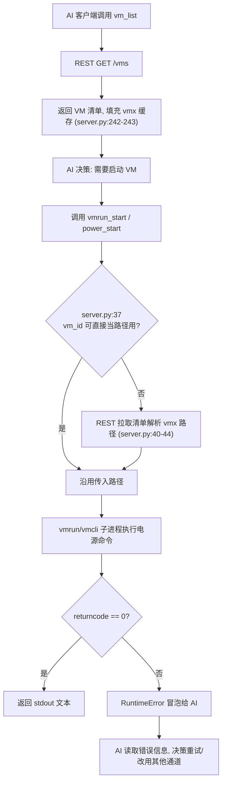

# vmware-mcp — 项目工作流分析报告

**分析时间**：2026-09-25_153605
**分析范围**：`C:\Users\Administrator\Desktop\zcode\mcp开发\VMware\vmware-mcp-gy`

---

## 1. CI/CD 管线

**状态**：未发现 CI/CD 配置。

- 无 `.github/workflows/`、`.gitlab-ci.yml`、`Jenkinsfile`（全仓库目录扫描确认，仅存在 `pyproject.toml` 一个 TOML 配置）。
- 无 lint/test/build 自动化阶段；`pyproject.toml` 中也未声明 `[tool.*]` 区段（`pyproject.toml:1-17` 全文仅 project/build-system 两个区段）。
- **影响**：130 个工具的行为回归完全依赖人工验证；README 中工具数量已与代码脱节（`README.md:7-13` 声称 117，实际 130），正是缺少自动化一致性检查的直接证据。

---

## 2. 测试策略

**状态**：零测试。

| 测试类型 | 框架 | 文件数 | 位置 |
|---------|------|--------|------|
| 单元测试 | 无 | 0 | — |
| 集成测试 | 无 | 0 | — |
| E2E 测试 | 无 | 0 | — |

- 全仓库无 `test`/`tests`/`__tests__` 目录及 `*_test.py`/`test_*.py` 文件（目录树扫描确认，见分析过程记录）。
- `pyproject.toml` 无 pytest/unittest 依赖与配置。
- **可测性基础**：适配器类构造函数支持路径注入（`vmrun.py:10`、`vmcli.py:12`），理论上可通过伪造可执行文件做集成测试；但 `server.py` 的 `call_tool` 直接读取模块级全局（`server.py:229-231`）且无依赖注入点，分支级单测需先重构。

---

## 3. 核心业务流程映射

项目业务域为"VMware Workstation Pro 自动化运维"。按工具族群划分出 5 个核心流程：

### 流程 1：VM 生命周期管理（查询 → 电源 → 删除）

**涉及模块**：`server.py`（REST 分支）、`client.py`、`vmrun.py`、`vmcli.py`
**触发条件**：MCP 客户端调用 `vm_list`/`vm_power_set`/`vmrun_start`/`power_stop` 等工具
**参与角色**：AI 客户端（Claude Code）、vmrest 服务、vmrun.exe/vmcli.exe、VMware Workstation



**关键代码路径**：
1. `server.py:240-243` — `vm_list` 并填充缓存
2. `server.py:34-45` — vmx 路径解析（三通道共用的前置步骤）
3. `vmrun.py:41-42` / `vmcli.py:205-206` — 电源命令
4. `client.py:42-43` — REST 电源变更

### 流程 2：客户机（Guest）文件与进程操作

**涉及模块**：`server.py:315-342`（vmrun 分支）、`server.py:391-410`（vmcli 分支）、`vmrun.py:96-156`、`vmcli.py:57-138`
**触发条件**：调用 `vmrun_ls`/`vmrun_copy_to`/`guest_run`/`guest_kill` 等
**参与角色**：AI 客户端、CLI 工具、客户机内 VMware Tools、**客户机操作系统账户**

**关键差异点**：guest 操作需要 `user`/`password` 参数（客户机凭据），且两个通道传递方式不同——vmrun 在命令前缀加 `-gu`/`-gp`（`vmrun.py:18-21`），vmcli 在子命令后追加 `-u`/`-P`（如 `vmcli.py:62-65`）。

### 流程 3：快照管理

**涉及模块**：`vmrun.py:77-94`、`vmcli.py:38-55`
**触发条件**：`vmrun_snapshot_take`/`snapshot_revert`/`snapshot_clone` 等
**流程**：解析 vmx → 执行快照动词（Take/Revert/Delete/Clone）→ 文本结果回传

### 流程 4：网络配置（端口转发）

**涉及模块**：`client.py:87-94`（REST 通道）、`vmrun.py:212-222`（vmrun 通道）
**触发条件**：`network_portforward_set`（REST）/ `vmrun_portforward_set`（CLI）
**数据变换**：`{vmnet, protocol, port, guest_ip, guest_port}` → REST PUT body `{"guestIp": ..., "guestPort": ...}`（`server.py:281`，注意参数名从 snake_case 转 camelCase）或 argv 数组（`vmrun.py:216-219`）

### 流程 5：硬件资源调整（芯片组/磁盘/网卡）

**涉及模块**：`vmcli.py:150-161`（Chipset）、`vmcli.py:180-188`（Disk）、`vmcli.py:223-243`（Ethernet）
**触发条件**：`chipset_set_cpu`/`disk_extend`/`ethernet_set_type` 等
**特征**：纯 vmcli 通道，整数参数经 `str()` 序列化进 argv（如 `vmcli.py:155` 的 `str(count)`）

---

## 4. 决策树提取

### 决策树 1：工具分发（call_tool 主干）

条件链（`server.py:239-510`，约 130 个分支的骨架）：

```
call_tool(name, arguments)  (server.py:228)
├── 条件1: name 属于 REST 前缀族（vm_* / network_*）? (server.py:240-284)
│   ├── 是 → 直接用 client 实例，vm_id 原样传 REST API（无 vmx 转换）
│   │   └── 条件1a: 返回 None 的删除类操作? (server.py:249-250,263-264,272-273,283-284)
│   │       ├── 是 → 手工补 {"status": "deleted"}
│   │       └── 否 → 直接采用 client 返回值
├── 条件2: name 属于 vmrun_* 前缀族? (server.py:287-378)
│   ├── 是 → 条件2a: vm_id 需转 vmx 路径?（一律调用 vmx() helper, server.py:236-237）
│   │   ├── 以 .vmx 结尾 / 含路径分隔符 → 原样使用 (server.py:37)
│   │   └── 否则 → 查缓存, 未命中则 REST 全量拉取 (server.py:40-44)
│   │   └── 查不到 → 返回 ""（无报错, server.py:45）
│   └── 可选参数大量使用 a.get(key, default) 模式（如 server.py:296 a.get("gui", True)）
├── 条件3: name 属于 vmcli 前缀族（snapshot_*/guest_*/power_*/...）? (server.py:381-510)
│   ├── 是 → 同样经 vmx() 转换后调 vmcli
│   └── 例外: template_deploy 不传 vmx（server.py:434 → vmcli.py:177-178 传 None）
└── 条件4: 无任何分支匹配 → result 保持 None (server.py:232)
    └── 返回 "OK"（server.py:512-514）——【潜在缺陷: 静默成功, 无错误提示】
```

### 决策树 2：vmx 路径解析（get_vmx_path）

```
get_vmx_path(vm_id)  (server.py:34-45)
├── 条件1: vm_id.endswith(".vmx") or "/" in vm_id or "\\" in vm_id? (server.py:37)
│   ├── 是 → 直接返回 vm_id（视为已是路径）
│   └── 否 → 条件2: vm_id in _vm_path_cache? (server.py:40)
│       ├── 否 → 条件3: REST list_vms() 成功? (server.py:41-42)
│       │   ├── 成功 → 填充全部映射 (server.py:43-44)
│       │   └── 抛异常（HTTPError 等, 无捕获）
│       └── return cache.get(vm_id, "") (server.py:45)
│           └── 找不到 → ""（下游 CLI 报错, 语义丢失）
```

**缺少默认分支标记**：`server.py:37` 的判定存在误判面——若某个 VM 的显示名恰好含 `/` 或 `\`（非路径场景），会被误判为路径；反之 REST 返回的 vmx 路径在 Windows 下含 `\`，恰好被覆盖。该启发式无注释说明边界。

### 决策树 3：CLI 执行错误提取

```
_run() 子进程结束  (vmrun.py:30 / vmcli.py:30)
├── returncode == 0 → 返回 stdout 解码
└── returncode != 0
    ├── [vmrun] stderr 非空? (vmrun.py:33-34)
    │   ├── 是 → RuntimeError("vmrun failed: " + stderr)
    │   └── 否 → 回退 stdout (vmrun.py:35)
    └── [vmcli] 无回退逻辑 → RuntimeError("vmcli failed: " + stderr) (vmcli.py:32-34)
        └── 若 stderr 为空 → 错误消息为 "vmcli failed: "（空消息, 潜在缺陷）
```

### 业务规则量化（硬编码常量）

| 常量 | 值 | 位置 |
|------|-----|------|
| REST 默认端口 | 8697 | `server.py:20`、`client.py:10` |
| REST 默认主机 | localhost | `server.py:19`、`client.py:10` |
| vmrun 默认路径 | `C:\Program Files (x86)\VMware\VMware Workstation\vmrun.exe` | `vmrun.py:13` |
| vmcli 默认路径 | `C:\Program Files (x86)\VMware\VMware Workstation\vmcli.exe` | `vmcli.py:15` |
| vmrun 目标类型 | `-T ws`（Workstation） | `vmrun.py:17` |
| 默认克隆类型 | linked | `server.py:290`（vmrun 版）、`server.py:390` 与 `vmcli.py:54`（vmcli 版） |
| 默认磁盘类型 | scsi | `server.py:438` |
| vmrun_start 默认 GUI | True | `server.py:296` |
| snapshot_delete 删除子快照默认值 | False | `server.py:312,388` |

**超时类常量缺失**：HTTP 与子进程均无超时设定（见 02 报告第 6 节），属"应有而未有"的规则。

---

## 5. 异常恢复路径分析

| 流程步骤 | 可能失败点 | 异常处理方式 | 恢复策略 | 代码位置 |
|---------|-----------|------------|---------|---------|
| REST 请求 | vmrest 未启动/网络不可达 | `httpx.ConnectError` 直抛 | 无重试、无降级 | `client.py:16` |
| REST 请求 | 4xx/5xx | `HTTPStatusError` 直抛 | 无重试 | `client.py:17` |
| REST 请求 | 空 body | 返回 `None`（正常路径） | — | `client.py:18-20` |
| vmx 解析 | VM ID 不存在 | 返回 `""` 不报错 | **无恢复**，错误延迟到 CLI | `server.py:45` |
| vmrun 执行 | 非零退出 | `RuntimeError` 携带 stderr | 无重试，由 AI 客户端决策 | `vmrun.py:32-36` |
| vmcli 执行 | 非零退出 | `RuntimeError` 携带 stderr | 无重试 | `vmcli.py:32-34` |
| 参数提取 | 必填参数缺失 | `KeyError` 直抛 | 无校验提示 | 如 `server.py:245` |
| 未知工具名 | 分发落空 | **静默返回 OK** | 无（错误被掩盖） | `server.py:232,512-514` |
| 输出解码 | 非法 UTF-8 字节 | `errors="replace"` 容错替换 | 局部字符丢失但流程继续 | `vmrun.py:33,35,38` |

**总体评价**：所有失败路径均为"抛出即终止"，零自动恢复（无重试/退避/熔断，检索确认全库无相关逻辑）；恢复责任完全转移给上游 AI 客户端——这符合 MCP 服务器"薄适配层"的定位，但 `server.py:512-514` 的静默 OK 与 `server.py:45` 的空路径是两处会主动掩盖失败的例外，需要修复。

---

## 6. 开发工作流

### 分支策略

- **主分支**：`master`（`git branch` 输出），生产部署方式为 `pip install -e .`（`README.md:26`）。
- **远程**：`origin`（Guiyuan1111/vmware-mcp-gy）与 `upstream`（ZacharyZcR/vmware-mcp）两个远端并存，说明本仓库是上游项目的 fork 改造版（`git remote -v` 输出）。
- 无 develop/release/feature 分支模式，单人直线式提交。

### 提交历史分析（快照时点：9 个提交，1 位贡献者 ZacharyZcR）

| 提交 | 主题 | 对应阶段 |
|------|------|---------|
| `83ed4ce` | Initial project structure | 脚手架 |
| `496f6f9` | Implement VMware Workstation Pro MCP server | 核心实现 |
| `db11e62` | Add README | 文档 |
| `3b87dab` | Fix stdio_server usage | 运行修复 |
| `a1d202f` | Add vmcli integration for advanced VM operations | 功能扩展（vmcli 通道引入） |
| `f2e74c7` | Add complete vmrun and vmcli coverage | 功能扩展（全量覆盖） |
| `9870c9d` | Update README with complete tool reference | 文档同步 |
| `d041375` | Fix get_vmx_path to support direct vmx paths | 行为修复（`server.py:37` 即该提交产物） |
| `5b4f4c2` | docs: 中文化 README | 文档中文化 |

**演进脉络**：REST → 修运行问题 → 加 vmcli → 补全 vmrun/vmcli 覆盖 → 修 vmx 路径兼容。功能增长模式为"通道逐个接入、每个通道一次全覆盖提交"，印证了 04 报告中"工具注册高度模板化"的判断。

> 时点说明：上表为分析快照（2026-09-25_153605）数据。当日复审新增 2 个文档修正提交后，仓库实为 11 个提交、2 位贡献者（ZacharyZcR 9、Guiyuan1111 2）。

### Code Review 与发布流程

- 无 PR 模板、无 review 配置（无 `.github/` 目录）。
- 无版本发布流程：`pyproject.toml:3` 与 `src/vmware_mcp/__init__.py:3` 均为 `0.1.0`，无 Tag、无 CHANGELOG。
- 无测试门禁，任何提交可直接到达 master。

### 隐含的"AI 协作开发"痕迹（推断，非事实认定）

提交信息风格与单一直线历史、一次性大批量工具接入（`f2e74c7`）符合 AI 结对开发的产出特征；README 以中文维护（`README.md:3`），面向中文用户群。
