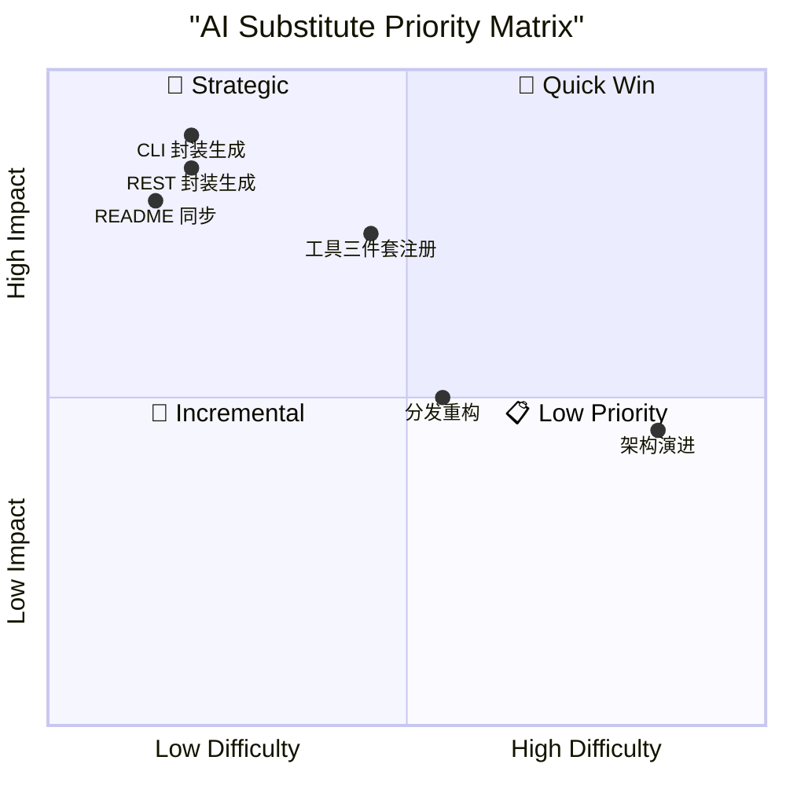

# vmware-mcp — AI 工作流替代方案报告

**分析时间**：2026-09-25_153605
**分析范围**：`C:\Users\Administrator\Desktop\zcode\mcp开发\VMware\vmware-mcp-gy`

---

## 1. 评估方法论

### 评分维度

| 维度 | 说明 | 低分（1-2） | 高分（4-5） |
|------|------|------------|------------|
| 确定性 | 输出是否可预测 | 高度创造性 | 完全确定性 |
| 输入结构化 | 输入是否边界清晰 | 模糊开放 | 严格结构化 |
| 安全风险 | 生成代码出错时的影响 | 灾难性 | 无影响 |
| 领域复杂度 | 所需专业程度 | 需要专家 | 通用知识 |
| 上下文需求 | 处理所需信息量 | 需整个代码库 | 局部即可 |
| 重复性 | 任务发生频率 | 一次性 | 高频重复 |

### 分级标准

| 等级 | 总分 | 策略 |
|------|------|------|
| 🤖 完全 AI 化 | 24-30 | AI 直接执行，无需人工介入 |
| 🧑‍💻 AI 辅助 | 15-23 | AI 生成初稿，人工审核后落地 |
| 👤 人工主导 | 6-14 | AI 仅提供参考，核心判断由人完成 |

---

## 2. 模块级评估

### 模块 1：REST 客户端封装（client.py）

**路径**：`src/vmware_mcp/client.py`（1 文件，94 行，23 个 API 方法）
**当前状态**：每个方法都是"路径拼接 + `_request` 委托"的一行式封装（如 `client.py:23-24`）。

**6 维评分**：

| 确定性 | 输入结构化 | 安全风险 | 领域复杂度 | 上下文需求 | 重复性 | 总分 |
|--------|-----------|---------|-----------|-----------|-------|------|
| 5 | 5 | 4 | 4 | 5 | 5 | **28/30** |

**结论**：🤖 **完全 AI 化**。方法体完全同构，仅需"端点路径 + HTTP 动词 + 参数形状"即可批量生成；REST API 语义由 VMware 官方文档锚定。

**AI 替代方式**：给定端点清单（方法名、动词、路径模板、参数），AI 按既有模板批量生成方法并接入 `server.py`。现有 4 个已实现未暴露的方法（`client.py:52-53,68-69,81-85`）说明"封装生成"与"工具暴露"存在脱节，AI 化后可顺带消除。

**接口契约要点**（`_request`，`client.py:14-20`）：前置条件为 vmrest 服务可达；后置条件为 2xx 返回 JSON（空 body 返回 `None`）；错误场景为非 2xx → `httpx.HTTPStatusError`。生成代码必须保留 `raise_for_status()` 与空 body 判空两条语义。

**风险与限制**：URL 路径参数（如 `vm_id` 含特殊字符）当前未编码（`client.py:27`），AI 生成时应引入 `urllib.parse.quote` 修正而非复刻缺陷。

**优先级**：⭐⭐⭐ 高 — Quick Win

**对应Blueprint**：[blueprints/01-rest-client-generator.md](blueprints/01-rest-client-generator.md)

---

### 模块 2：vmrun 命令行封装（vmrun.py）

**路径**：`src/vmware_mcp/vmrun.py`（1 文件，222 行，46 个命令方法）

**6 维评分**：

| 确定性 | 输入结构化 | 安全风险 | 领域复杂度 | 上下文需求 | 重复性 | 总分 |
|--------|-----------|---------|-----------|-----------|-------|------|
| 5 | 5 | 4 | 4 | 5 | 5 | **28/30** |

**结论**：🤖 **完全 AI 化**。46 个方法全部遵循同一模板（组装参数 → `_run`），唯一的变体点是可选标志（`-noWait`/`-activeWindow`/`-interactive`，`vmrun.py:130-135`）和布尔后缀（`"hard" if hard else "soft"`，`vmrun.py:45`）。

**AI 替代方式**：输入为（方法名、vmrun 动词、参数顺序表、可选标志表），输出为方法代码。vmrun 官方文档的命令清单即为结构化输入源。

**接口契约要点**（`_run`，`vmrun.py:16-38`）：前置条件为 `VMRUN_PATH` 指向的 vmrun.exe 存在；后置条件为 returncode 0 时返回 stdout 文本；错误场景为非零退出 → `RuntimeError("vmrun failed: ...")`（stderr 优先回退 stdout）。

**风险与限制**：guest 凭据经 argv 传递（`vmrun.py:20-21`）是现存安全隐患，AI 重生成时建议评估 stdin/env 传递方案；`run_program` 的 `args.split()`（`vmrun.py:138`）对含空格参数会错误分词，需人工确认是否改为列表参数。

**优先级**：⭐⭐⭐ 高 — Quick Win

**对应Blueprint**：[blueprints/02-cli-wrapper-generator.md](blueprints/02-cli-wrapper-generator.md)

---

### 模块 3：vmcli 命令行封装（vmcli.py）

**路径**：`src/vmware_mcp/vmcli.py`（1 文件，308 行，67 个命令方法）

**6 维评分**：

| 确定性 | 输入结构化 | 安全风险 | 领域复杂度 | 上下文需求 | 重复性 | 总分 |
|--------|-----------|---------|-----------|-----------|-------|------|
| 5 | 5 | 4 | 4 | 5 | 5 | **28/30** |

**结论**：🤖 **完全 AI 化**。67 个方法中 65 个是"`模块 + 子命令 + 选项`"三段式的机械映射（如 `vmcli.py:154-155`），仅 `guest_*` 族有可选参数追加逻辑（`vmcli.py:58-66`）。

**AI 替代方式**：vmcli 的模块/子命令/选项名是公开枚举值，天然结构化；`vmcli.py:38-308` 本身就是完整的"输入→输出"示例集。

**接口契约要点**（`_run`，`vmcli.py:18-36`）：与 vmrun 的两点差异必须保留——首参 `vmx_path` 可为 `None`（`template_deploy`，`vmcli.py:177-178`）；错误消息仅取 stderr（`vmcli.py:33`）。

**风险与限制**：`vmcli` 的选项字母语义（`-n`/`-p`/`-s`/`-t` 在不同子命令下含义不同）需要逐条核对官方文档，AI 幻觉风险集中于此，应强制对照源代码现有映射。

**优先级**：⭐⭐⭐ 高 — Quick Win

**对应Blueprint**：[blueprints/02-cli-wrapper-generator.md](blueprints/02-cli-wrapper-generator.md)

---

### 模块 4：MCP 工具注册（T 工厂 + list_tools）

**路径**：`src/vmware_mcp/server.py:48-224`
**当前状态**：130 个 `T(...)` 调用，每个声明工具名、描述、JSON Schema 属性与必填项。

**6 维评分**：

| 确定性 | 输入结构化 | 安全风险 | 领域复杂度 | 上下文需求 | 重复性 | 总分 |
|--------|-----------|---------|-----------|-----------|-------|------|
| 5 | 4 | 3 | 4 | 4 | 5 | **25/30** |

**结论**：🤖 **完全 AI 化**。Schema 声明完全由目标方法签名推导；描述文本可从 README 表格（`README.md:48-190`）映射。安全风险 3 分的原因：schema 的 `required` 或 enum 写错会让 AI 客户端构造出错误参数（如把删除类操作的必填项漏掉），属"错误会传播到运行时"的声明层风险。

**AI 替代方式**：将"wrapper 方法签名 → T() 声明 → call_tool 分支"三件套作为单一原子任务交给 AI（见 Blueprint 03），由签名一致性保证三方对齐。

**风险与限制**：工具名与分支名的字符串对齐是本模块核心风险（现状靠人工，`server.py:56-224` 与 `server.py:239-510` 无映射表）；AI 化时应同步引入"声明即路由表"的结构（dict 映射替代 if/elif）。

**优先级**：⭐⭐⭐ 高 — Quick Win

**对应Blueprint**：[blueprints/03-mcp-tool-registrar.md](blueprints/03-mcp-tool-registrar.md)

---

### 模块 5：call_tool 分发逻辑（含参数映射）

**路径**：`src/vmware_mcp/server.py:227-514`（约 288 行）

**6 维评分**：

| 确定性 | 输入结构化 | 安全风险 | 领域复杂度 | 上下文需求 | 重复性 | 总分 |
|--------|-----------|---------|-----------|-----------|-------|------|
| 4 | 4 | 2 | 3 | 4 | 5 | **22/30** |

**结论**：🧑‍💻 **AI 辅助**。分支模板高度机械（130 个分支中约 120 个为单行委托），但存在两类需要人工把关的点：
1. **参数名转换**：REST 通道的 snake_case → camelCase 映射（`server.py:281`：`guest_ip → {"guestIp": ...}`）写错会静默丢失参数；
2. **可选参数默认值**：`a.get("gui", True)`（`server.py:296`）这类默认值语义（启动默认带 GUI）是业务决策，写错即改变行为。
3. **分发落空**：未知工具名静默返回 `OK`（`server.py:512-514`），AI 重构时应改为显式错误。

**AI 替代方式**：AI 按模板生成分支 + 人工 review 默认值与参数转换表；长期方案是改为"路由表 + 通用调用器"消除 if/elif。

**优先级**：⭐⭐ 中 — 与模块 4 捆绑实施

**对应Blueprint**：[blueprints/03-mcp-tool-registrar.md](blueprints/03-mcp-tool-registrar.md)（作为其中的 Step 3 覆盖）

---

### 模块 6：工具文档同步（README 工具表）

**路径**：`README.md:7-13`（汇总表）与 `README.md:48-190`（明细表）

**6 维评分**：

| 确定性 | 输入结构化 | 安全风险 | 领域复杂度 | 上下文需求 | 重复性 | 总分 |
|--------|-----------|---------|-----------|-----------|-------|------|
| 5 | 4 | 5 | 4 | 4 | 4 | **26/30** |

**结论**：🤖 **完全 AI 化**。明细表可从 `list_tools()` 的 130 个 `T()` 声明机械生成。

**现状即证据**：README 汇总表声称 117 个工具（`README.md:7-13`：REST 20 + vmrun 54 + vmcli 43），代码实际 130 个（REST 19 + vmrun 46 + vmcli 65，`server.py:61-223`）——三个数字全部不符。这正是"文档靠手工维护"造成的漂移。

**AI 替代方式**：AI 从 `list_tools()` 提取工具清单，自动重生成 README 的汇总表与三个明细表；纳入提交前检查。

**优先级**：⭐⭐⭐ 高 — Quick Win（立即可做，直接修复现存错误）

**对应Blueprint**：[blueprints/04-tool-consistency-auditor.md](blueprints/04-tool-consistency-auditor.md)

---

### 模块 7：架构演进决策（通道去重、错误体系重构）

**6 维评分**：

| 确定性 | 输入结构化 | 安全风险 | 领域复杂度 | 上下文需求 | 重复性 | 总分 |
|--------|-----------|---------|-----------|-----------|-------|------|
| 2 | 2 | 2 | 1 | 2 | 2 | **11/30** |

**结论**：👤 **人工主导**。例如"快照工具在 vmrun 与 vmcli 通道重复暴露"（`vmrun_snapshot_take`，`server.py:100` vs `snapshot_take`，`server.py:146`）是否合并、"REST/vmrun/vmcli 三通道的电源动词如何统一"等问题涉及使用习惯、兼容性与安全面取舍，AI 只能提供分析输入，决策需人做。

**优先级**：📋 观察

---

## 3. 函数级替代粒度分析（抽样深度 + 全覆盖清单）

### 3.1 函数清单与 AI 替代潜力（按模块汇总，全量）

**总计 151 个函数/方法**：server.py 9 个、client.py 25 个、vmrun.py 48 个、vmcli.py 69 个（含 `__init__` 与私有 `_run`/`_request`，明细见 01 报告第 5 节）。

| 函数（代表） | 签名 | 位置 | 行数 | 圈复杂度 | 外部依赖 | AI 替代潜力 |
|-------------|------|------|------|---------|---------|------------|
| `client._request` | `async (method, path, **kwargs) -> Any` | `client.py:14-20` | 7 | 2 | httpx | 完全 AI 化（一次性生成后稳定） |
| `client.list_vms` 等 23 个 | 各一行的端点封装 | `client.py:23-94` | 1-2/个 | 1 | httpx（经 _request） | 完全 AI 化（批量） |
| `vmrun._run` | `async (command, *args, guest_user="", guest_pass="") -> str` | `vmrun.py:16-38` | 23 | 3 | asyncio | 完全 AI 化 |
| `vmrun.start` 等 46 个 | 同构薄封装 | `vmrun.py:41-222` | 1-11/个 | 1-2 | vmrun.exe（经 _run） | 完全 AI 化（批量） |
| `vmcli._run` | `async (vmx_path, module, command, *args) -> str` | `vmcli.py:18-36` | 19 | 2 | asyncio | 完全 AI 化 |
| `vmcli.snapshot_take` 等 67 个 | 同构薄封装 | `vmcli.py:39-308` | 1-9/个 | 1-2 | vmcli.exe（经 _run） | 完全 AI 化（批量） |
| `server.T` | `(name, desc, props, required) -> Tool` | `server.py:48-53` | 6 | 2 | mcp.types | 完全 AI 化 |
| `server.list_tools` | `async () -> list[Tool]` | `server.py:56-224` | 169 | 1（线性） | mcp.types | 完全 AI 化（声明生成） |
| `server.call_tool` | `async (name, arguments) -> list[TextContent]` | `server.py:227-514` | 288 | ~130（分支） | 三适配器 | AI 辅助（默认值/参数映射需人工 review） |
| `server.get_vmx_path` | `async (vm_id) -> str` | `server.py:34-45` | 12 | 4 | client | AI 辅助（含缓存语义与边界判定，需 review） |
| `server.main`/`run` | `() -> None` | `server.py:517-524` | 8 | 1 | mcp.server | 完全 AI 化（一次性样板） |

### 3.2 接口契约提取（代表性函数）

#### get_vmx_path 接口契约（`server.py:34-45`）

**前置条件**：
- `vm_id` 为 VM ID 或 vmx 路径字符串；非路径时要求 REST 通道可达且目标 VM 存在于清单中
- `_vm_path_cache` 为模块级可变字典（`server.py:14`）

**后置条件**：
- 返回 vmx 路径字符串；**找不到时返回空串 `""` 而非抛错**
- 缓存未命中时副作用：全量拉取并重建 `vm_id → path` 映射（不清除陈旧条目）

**错误场景**：

| 错误 | 触发条件 | 行为 |
|------|---------|------|
| `httpx.HTTPStatusError` | vmrest 返回非 2xx | 直抛至 MCP 框架层 |
| `httpx.ConnectError` | vmrest 不可达 | 直抛 |
| 静默空串 | VM ID 不存在 | 返回 `""`，下游 CLI 报错 |

#### call_tool 接口契约（`server.py:227-514`）

**前置条件**：
- `name` 必须与 `list_tools()` 中 130 个声明之一精确匹配（字符串相等）
- `arguments` 必须满足对应 `T()` 声明的 schema；必填项缺失触发 `KeyError`（无友好校验）

**后置条件**：
- 返回单元素 `list[TextContent]`；`str` 结果原样（空串 → `"OK"`），结构化结果 `json.dumps(indent=2)`，`None`/空值 → `"OK"`（静默成功，缺陷）

**错误场景**：

| 错误 | 触发条件 | 行为 |
|------|---------|------|
| `KeyError` | 必填参数缺失（如 `a["vm_id"]`，`server.py:245`） | 直抛 |
| `RuntimeError("vmrun failed: ...")` | vmrun 非零退出（`vmrun.py:36`） | 直抛 |
| `RuntimeError("vmcli failed: ...")` | vmcli 非零退出（`vmcli.py:34`） | 直抛 |
| `httpx.HTTPStatusError` | REST 4xx/5xx（`client.py:17`） | 直抛 |
| **静默 OK** | `name` 未匹配任何分支 | 返回 `"OK"`（`server.py:512-514`）——缺陷 |

### 3.3 依赖与上下文需求分析

| 依赖类型 | 具体内容 | 来源位置 | AI Skill 所需 Context |
|---------|---------|---------|---------------------|
| 框架类型 | `Tool`、`TextContent`、`Server`、`stdio_server` | `server.py:5-7` | mcp SDK 的 Tool/inputSchema 结构 |
| JSON Schema 规范 | `{"type": "object", "properties": ..., "required": ...}` | `server.py:50-53` | JSON Schema Draft 基础知识 |
| REST 端点语义 | `/vms`、`/vms/{id}/power`、`/vmnet/{vmnet}/portforward` 等 | `client.py:23-94` | VMware Workstation REST API 文档 |
| vmrun 命令语义 | 46 个动词及标志（`-T ws`、`-gu/-gp`、`hard/soft`） | `vmrun.py:17-23` 及各方法 | VMware vmrun 官方命令参考 |
| vmcli 三段式语义 | 模块/子命令/选项（`Snapshot Take -n` 等） | `vmcli.py:39-308` | vmcli 命令参考 |
| 环境配置 | `VMWARE_HOST/PORT/USERNAME/PASSWORD`、`VMRUN_PATH`、`VMCLI_PATH` | `server.py:19-22`、`vmrun.py:11-14`、`vmcli.py:13-16` | 配置常量表 |
| 现存缺陷清单 | 静默 OK、空 vmx 路径、URL 未编码、无超时 | `server.py:45,512-514`、`client.py:15,27` | 生成新代码时须避免复刻（见各 Blueprint Constraints） |

---

## 4. ROI 优先级矩阵

| 模块 | 评分 | 等级 | 实施难度 | 预期收益 | 优先级 | 阶段 |
|------|------|------|---------|---------|--------|------|
| 工具文档同步（README） | 26/30 | 完全 AI 化 | 低 | 高（立即修复 117→130 漂移） | 🥇 高 | Phase 1 |
| vmrun/vmcli 封装生成 | 28/30 | 完全 AI 化 | 低 | 高（新增命令零手工） | 🥇 高 | Phase 1 |
| REST 封装生成 | 28/30 | 完全 AI 化 | 低 | 高 | 🥇 高 | Phase 1 |
| MCP 工具三件套注册 | 25/30 | 完全 AI 化 | 中 | 高（消除声明/实现漂移） | 🥈 中 | Phase 2 |
| call_tool 分发重构 | 22/30 | AI 辅助 | 中 | 中 | 🥈 中 | Phase 2 |
| 架构演进决策 | 11/30 | 人工主导 | 高 | 中 | 🥉 低 | Phase 3 |

---

## 5. AI 改造路线图

### Phase 1 — Quick Win（建议本月实施）

| 事项 | 措施 | 预期效果 | 资源需求 |
|------|------|---------|---------|
| README 工具表重建 | AI 从 `list_tools()` 生成文档 | 消除 117/130 漂移；未来零手工维护 | Blueprint 04 |
| 新命令封装流水线 | AI 按 Blueprint 01/02 生成封装 | 单命令接入从 ~10 分钟降至 1 分钟 | Blueprint 01/02 |
| 缺口工具补全 | 为 6 个死方法补 T() 声明与分支（或明确移除） | 消除实现/暴露脱节 | Blueprint 03 |

### Phase 2 — Strategic（建议本季度实施）

| 事项 | 措施 | 预期效果 | 资源需求 |
|------|------|---------|---------|
| 路由表化 | call_tool 的 if/elif 改为 dict 路由表 | 未匹配显式报错；分支代码量 -90% | Blueprint 03 |
| 声明/实现一致性测试 | AI 生成"每个 T() 声明都有分支且参数名一致"的元测试 | 回归防护从 0 → 100% 覆盖面 | Blueprint 04 扩展 |
| 错误处理统一 | 修复静默 OK、空 vmx 路径；vmcli 补 stdout 回退 | 失败可见性提升 | 人工主导 + AI 辅助 |

### Phase 3 — Transformative（建议本年度规划）

| 事项 | 措施 | 预期效果 | 资源需求 |
|------|------|---------|---------|
| 通道去重 | 合并 vmrun/vmcli 重复暴露的电源/快照工具 | 130 工具瘦身、AI 客户端选择成本下降 | 架构决策（人工） |
| 安全加固 | guest 凭据改 stdin/env 传递；REST 加超时与 TLS 校验开关 | 攻击面收窄 | 人工主导 |

---

## 6. 实施前提与建议

### 前提条件

- [x] 项目代码高度模板化，AI 可理解性极好（同构率 >85%）
- [ ] 无测试基线 —— AI 生成代码的正确性目前只能靠人工抽查，建议先落地 Phase 2 的一致性元测试
- [ ] vmrun/vmcli/REST 官方文档可获取（AI 生成封装的输入源）
- [x] 单人项目，无协作冲突，可快速试行

### 开始建议

1. **从 Blueprint 04（一致性审计）起步**：零风险、立即修复 README 的数字错误，并建立防再漂移机制
2. **用 Blueprint 03 接入下一个新工具**：端到端验证"三件套一次生成"的可靠性后再批量推广
3. **把现存缺陷写进每个 Blueprint 的 Constraints**：防止 AI 复刻静默 OK、URL 未编码、无超时等已知问题

---

## 附录：评分明细

| 模块 | 确定性 | 输入结构化 | 安全风险 | 领域复杂度 | 上下文需求 | 重复性 | 总分 | 等级 |
|------|--------|-----------|---------|-----------|-----------|-------|------|------|
| REST 客户端封装 | 5 | 5 | 4 | 4 | 5 | 5 | 28 | 🤖 完全 AI 化 |
| vmrun CLI 封装 | 5 | 5 | 4 | 4 | 5 | 5 | 28 | 🤖 完全 AI 化 |
| vmcli CLI 封装 | 5 | 5 | 4 | 4 | 5 | 5 | 28 | 🤖 完全 AI 化 |
| MCP 工具注册 | 5 | 4 | 3 | 4 | 4 | 5 | 25 | 🤖 完全 AI 化 |
| 文档同步 | 5 | 4 | 5 | 4 | 4 | 4 | 26 | 🤖 完全 AI 化 |
| call_tool 分发 | 4 | 4 | 2 | 3 | 4 | 5 | 22 | 🧑‍💻 AI 辅助 |
| get_vmx_path/缓存 | 3 | 3 | 3 | 3 | 4 | 4 | 20 | 🧑‍💻 AI 辅助 |
| 架构演进决策 | 2 | 2 | 2 | 1 | 2 | 2 | 11 | 👤 人工主导 |
